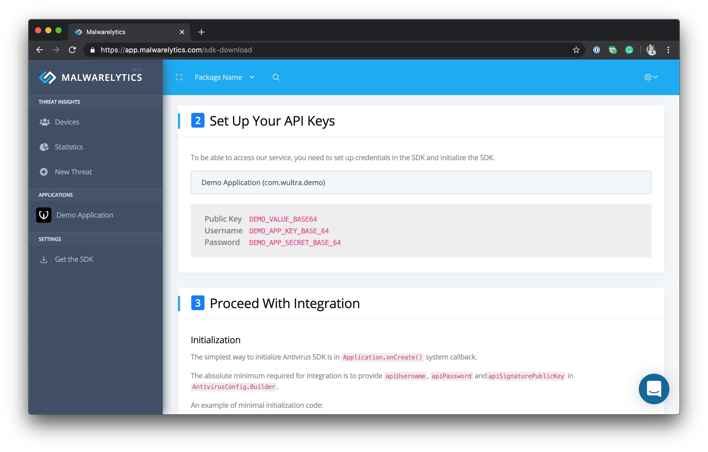

# Implementing Malwarelytics on iOS

<!-- AUTHOR joshis_tweets 2020-05-04T00:00:00Z -->
<!-- SIDEBAR _auto -->
<!-- TEMPLATE tutorial -->

This tutorial explains how you can integrate Malwarelytics - an advanced mobile threat intelligence and in-app protection - into your iOS app.

<!-- begin box warning -->
**Personalized Configuration Required.**<br/>
In order to use Malwarelytics for Apple, you need a custom configuration and access credentials for both the service and artifact repository. Contact your sales representative or technical consultant in order to obtain the required prerequisites.
<!-- end -->

## Get the Malwarelytics SDK

You can obtain the Malwarelytics SDK for Apple by clicking the **Get the SDK!** item in the left navigation. In the **Download the SDK** section, you will find your Artifactory credentials.

To add our private Cocoapods repository, install `cocoapods-art` plugin:

```sh
gem install cocoapods-art
```

Then, create an `.netrc` file in your home directory (`~`) with your credentials to Wultra Artifactory (or append the snippet, if the file already exists):

```
machine wultra.jfrog.io
      login [name@yourcompany.com]
      password [password]
```

Synchronize the remote repo locally:

```sh
pod repo-art add malwarelytics_apple https://wultra.jfrog.io/artifactory/api/pods/malwarelytics-apple
```

Enable the `cocoapods-art` plugin in your project by adding the following code to the first lines of the `Podfile`:

```rb
plugin 'cocoapods-art', :sources => [
    'malwarelytics_apple'
]
```

Add the new pod to your `Podfile`:

```rb
pod 'AppProtection'
```

And finally, install the pod from your project directory to make the `AppProtection` framework available in your project:

```sh
pod install
```

## Obtain the API Credentials

In the **Set Up Your API Keys** section in the Malwarelytics Console, select the application for which you need to obtain the configuration.



You will find the following values:

- `API_USERNAME` - Username associated with your Android application ID.
- `API_PASSWORD` - API password value.
- `API_SIGNATURE_PUBLIC_KEY` - Public key that the SDK uses to verify authenticity of data received from the server.

## Integrate the SDK

The main class for Malwarelytics SDK for Apple is `AppProtectionService` singleton. You are responsible for configuring the instance as soon as possible after the application launch. You should also implement the `AppProtectionRaspDelegate` to handle RASP callbacks.

The easiest way to initialize the Malwarelytics SDK in your `AppDelegate`:

```swift
import UIKit
import AppProtection

@main
class AppDelegate: UIResponder, UIApplicationDelegate, AppProtectionRaspDelegate {

    func application(_ application: UIApplication, didFinishLaunchingWithOptions launchOptions: [UIApplication.LaunchOptionsKey: Any]?) -> Bool {

        // Prepare a builder to connect to the service
        let builder = AppProtectionConfig.Builder()
            .username(API_USERNAME)
            .password(API_PASSWORD)
            .signaturePublicKey(API_SIGNATURE_PUBLIC_KEY)

        // Prepare the RASP feature configuration
        let raspConfig = AppProtectionRaspConfig.Builder()
            .jailbreak(.exit)
            .debugger(.block)
            .reverseEngineeringTools(.notify)
            .httpProxy(.notify)
            .repackage(.exit([AppProtectionTrustedCert(withBase64EncodedString: "$BASE_64_ENCODED_CERT")!]))
            .screencapture(.notify)
            .build()

        builder.raspConfig(raspConfig)

        // Prepare the configuration for events
        let eventsConfig = AppProtectionEventConfig.Builder()
            .enableAppLifecycleCollection(true)
            .enableScreenshotTakenCollection(true)
            .build()

        builder.eventsConfig(eventsConfig)

        do {
            // Configure the Service
            try AppProtectionService.configureShared(builder.build())
        } catch {
            // AppProtectionService singleton was already configured!
            return nil
        }

        // Set the delegate to obtain RASP callbacks
        AppProtectionService.shared.rasp.addDelegate(self)

        return true
    }

    // MARK: - AppProtectionRaspDelegate

    func debuggerDetected() {
        // react to debugger
    }

    func jailbreakDetected() {
        // react to jailbreak
    }

    func repackageDetected() {
        // react to repackage
    }

    func httpProxyEnabled() {
        // react to http proxy enabled
    }

    func userScreenshotDetected() {
        // react to user screenshot
    }

    func reverseEngineeringToolsDetected() {
        // react to reverse engineering tools
    }

    func systemPasscodeConfigurationChanged(enabled: Bool) {
        // react to system passcode change
    }

    func systemBiometryConfigurationChanged(enabled: Bool) {
        // react to biometry configuration changed
    }

}
```

Since the `AppProtectionService` is a singleton, you can easily access it from anywhere in the app. For example, you can set your internal user ID when it is available like this:

```swift
AppProtectionService.shared.clientAppUserId = clientId
```

<!-- begin box info -->
Do not forget to set your internal user ID. Otherwise, it will be difficult to identify which users devices are insecure, i.e., jailbroken. In the ideal situation, you can use an opaque random device identifier as the `INTERNAL_USER_ID`. However, any identifier that you can use to look up the infected device or the user will do the trick.
<!-- end -->

You can also access any RASP detections just-in-time, like so:

```swift
let isJailbroken = AppProtectionService.shared.rasp.isJailbroken
```

After you compile and launch the iOS application, Malwarelytics scan automatically starts and it sends the first impulse from your active device to the Malwarelytics service.

## Summary

We just integrated the Malwarelytics SDK into your iOS app and sent the first data sample to the Malwarelytics service. After you launch your app to the public, your Malwarelytics console will start to fill up with useful data about active insecure devices.

## Read Next

- [Malwarelytics for Apple Documentation](https://github.com/wultra/malwarelytics-apple)
