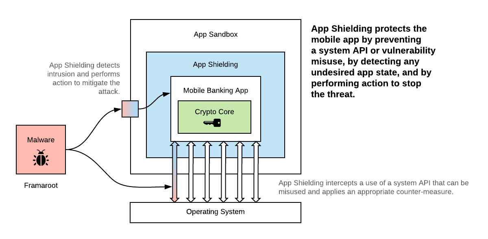
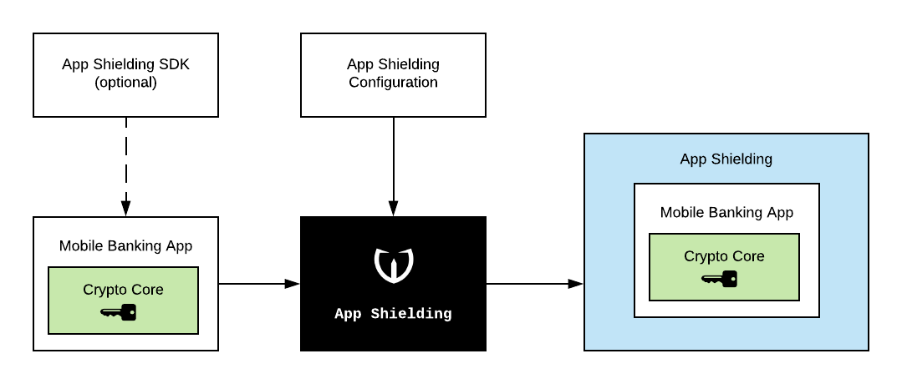

# Authentication in Mobile Banking Apps (SCA)

<!-- AUTHOR joshis_tweets 2020-06-22T00:00:00Z -->
<!-- SIDEBAR _Sidebar.md sticky -->

    

        <strong>Personalized Configuration Required.</strong> 
        In order to follow this tutorial, you need to purchase the App Shielding technology by Wultra and have a tooling as well as custom configuration prepared by Wultra engineers. Both tooling and configuration is specifically designed for your application. Contact your sales representative or technical consultant in order to obtain the required components.
    

In this tutorial, we will show you how to implement App Shielding by Wultra into your mobile apps on iOS and Android. This tutorial has three parts:

- **Mobile App Shielding Overview**
- [App Shielding for iOS](./iOS-Tutorial.md)
- [App Shielding for Android](./Android-Tutorial.md)

## Introduction

Mobile Application Shielding (or App Shielding, for short) protects your mobile app against a broad range of attacks caused by various OS vulnerabilities.

It hardens your app by strong code obfuscation, sensitive info extraction (hiding strings, keys and other constants embedded in the app), additional integrity checks and by adding an active self-protecting code. As a result, it makes sure that your app is protected even if running on a jailbroken/rooted device. It prevents debugger connections, stops code or framework injection, or prevents running the app in virtualized environment or on emulator. Additionally, it protects your app from untrusted screen readers, fake keyboards, blocks screen sharing or user/system screenshots.

    

        <strong>OWASP Mobile App Sec Verification Standard.</strong> 
        App Shielding covers the issues from category V8: Resilience. 
        <a href="https://mobile-security.gitbook.io/masvs/security-requirements/0x15-v8-resiliency_against_reverse_engineering_requirements" target="blank">Learn more</a>
    

## Applying App Shielding

For both iOS and Android, the App Shielding is applied automatically, by running a script with Wultra provided configuration over an existing `*.apk` or `*.ipa` file.

On both platforms, you can shield apps using a command-line script and configuration we prepare for you. This allows running App Shielding as the part of your continuous integration process. You can also integrate the App Shielding as a plugin to IDE (on iOS, using a custom script, on Android, using a Gradle plugin), for easier development.

Optionally, you can also include the App Shielding SDK in your app and handle some specific situation the way you want. However, this is an advanced functionality that we do not recommend when starting with App Shielding deployment.

## App Shielding Deployment Consequences

Applying App Shielding on your mobile app, has the following consequences:

- **You will exclude some users.** By using App Shielding, you accepted the idea that you prefer having a secure mobile runtime requirement from the ability to run your app anywhere. In certain situations, the App Shielding will terminate your app and redirect the user on your website with explanation. While this issue is small in practice (single cases per 100k users), you need to get ready that some users will ask questions or write angry comments about this, and you should prepare web pages that explain why the app exited.
- **Your app will be bigger and startup a bit slower.** App Shielding adds ~3MB to your app size for each platform, and it will slow down your app cold startup time by ~300ms (depending on a device model and Android version).

## Web Pages With Exit Reason Explanation

In certain situations, the App Shielding will terminate your app and redirect the user on your website. You need to provide the content on such website to the end user to explain what happened.

We prepared a simple plain HTML bundle with the example files (in English) and snippet for Google Analytics (Universal Analytics):

- [Download](./template.zip)
- [Example](./template/en/index.html){:target="blank"}

You can modify the plain HTML files and upload them to some FTP storage as a quick fix, or (preferably) prepare content in your main CMS system based on these examples.

In any case, we recommend:

- Preparing separate websites for iOS or Android platforms.
- Cover at these four topics with separate pages:
  - Debugger Connection - Displayed when debugger attempted to connect to your app and App Shielding did not manage to block such attempt.
  - Foreign Code Insertion - A foreign code was inserted into an app, by native code hooks, framework injection or code injection.
  - Repackaging Detection - The app bundle was modified.
    - _Note: This website may not display in certain situations, application will be terminated without the redirect._
  - Emulator Detection - The app was launched on emulator or in other untrusted runtime environment.
    _Note: This website may not display in certain situations, application will be terminated without the redirect._
- Preparing the websites in your main language, or allowing the website to switch language (possibly automatically, based on the `Accept-Language` header).
- Answering the following questions:
  - What happened?
  - What can be the consequence of the issue?
  - What could be the cause of the issue?
  - How can the user fix the issue.
- Adding contact information, so that the customers can reach you easily.
- Adding an analytics tool on the website and monitor the traffic.

When terminating the app, App Shielding will automatically redirect to the page appropriate for the particular situation and it will add additional information about the exit reason (such as device vendor and model, Android OS version, etc.) to the URL query parameters, where your analytics tool can pick it up.

## Continue Reading

Proceed with one of the following chapters:

- [App Shielding for iOS](iOS-Tutorial.md)
- [App Shielding for Android](Android-Tutorial.md)
